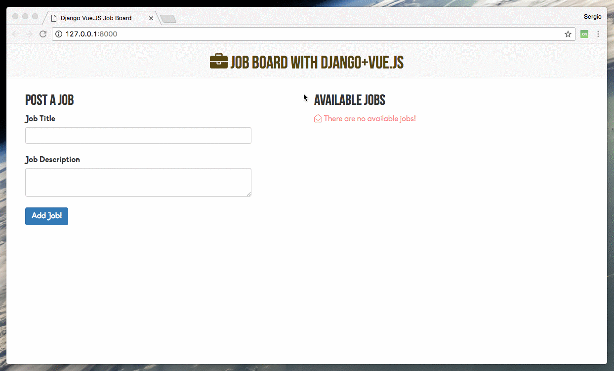

# DjangoVueJS

This is just a test project to use some features of `vue.js` on the front-end and `django-rest-framework` on the backend.

It is a simple `Job Board` that lets the user to add and delete jobs.

